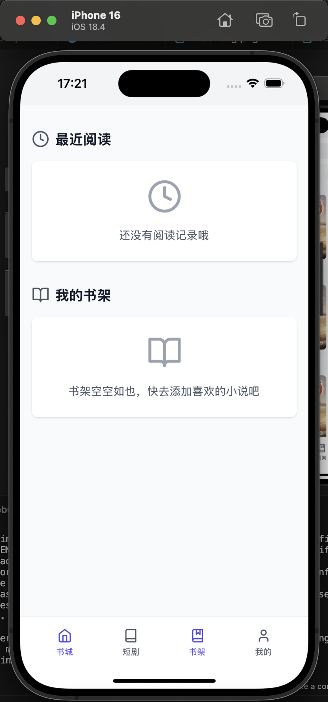

## Language

- [简体中文](README.md)
- [English](README.en.md)

# Tauri Novel App

A cross-platform novel reading application built with Tauri, React, and TypeScript. Supports desktop, Android, and iOS platforms.

## Screenshots





## Quick Start

```shell
# Node.js version must be >= 18
npm install
npm install --save-dev @tauri-apps/cli

# Web
npm run dev

# Desktop
npm run tauri dev

# Android
npm run tauri android dev

# iOS
npm run tauri ios dev
```

# Acknowledgments
This project is built with love and gratitude to the incredible open-source community. Special thanks to:

- Rust - The language that makes safe systems programming accessible and enjoyable
- Tauri - For creating an amazing framework that bridges Rust and web technologies
- React - For providing the foundation of modern UI development
- TypeScript - For bringing type safety to JavaScript
- Vite - For the lightning-fast development experience

This project was created with the hope of helping newcomers learn Rust development through practical examples. Whether you're from China, America, Europe, Africa, or anywhere else in the world - we're all part of one global community of developers learning and growing together.

世界人民大团结万岁！Unity of the world's people forever!

May this project serve as a bridge for knowledge sharing and inspire more developers to explore the wonderful world of Rust and cross-platform development.

## Contact

- Email: q1628652790@gmail.com
- Bilibili: https://space.bilibili.com/397296484


## Android App Signing

### 1. Generate Android Keystore
```shell
keytool -genkey -v \
  -keystore my-release-key.jks \
  -keyalg RSA \
  -keysize 2048 \
  -validity 10000 \
  -alias my-key-alias
```

### 2. Convert Keystore to Base64
```shell
# Linux
base64 my-release-key.jks > keystore.b64

# macOS
base64 -i my-release-key.jks -o keystore.b64
```

### 3. Add Secrets to GitHub Repository
- SIGNING_KEYSTORE_BASE64: Content from keystore.b64 file
- SIGNING_KEY_ALIAS: Alias set during keystore creation (my-key-alias)
- SIGNING_KEYSTORE_PASSWORD: Keystore password
- SIGNING_KEY_ALIAS_PASSWORD: Key alias password