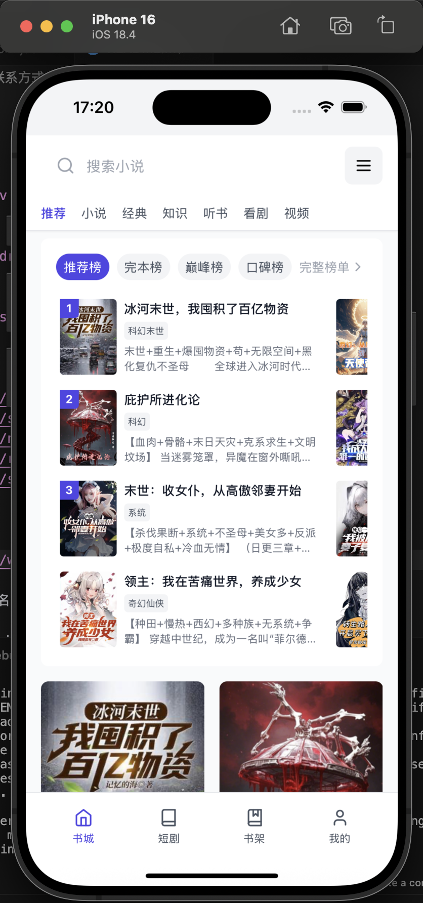

## Language

- [简体中文](README.md)
- [English](README.en.md)

# Tauri 小说应用

一个使用 Tauri、React 和 TypeScript 构建的跨平台小说阅读应用。支持桌面、Android 和 iOS 平台。

## 效果展示




## 快速开始

```shell
# nodejs 必须大于等于 18 版本
npm install
npm install --save-dev @tauri-apps/cli

# 网页
npm run dev

# 桌面
npm run tauri dev

# android app
npm run tauri android dev

# ios app
npm run tauri ios dev
```

# 致谢

本项目怀着对伟大开源社区的热爱和感激之情而创建。特别感谢：

- Rust - 让系统编程变得安全且充满乐趣的编程语言
- Tauri - 创造了连接 Rust 和 Web 技术的卓越框架
- React - 为现代 UI 开发提供了坚实基础
- TypeScript - 为 JavaScript 带来了类型安全
- Vite - 提供了闪电般的开发体验

这个项目的创建初衷是希望通过实际案例帮助新手同学学习 Rust 开发。无论你来自中国、美国、欧洲、非洲，还是世界上的任何地方——我们都是同一个全球开发者社区的一员，一起学习，共同成长。

世界人民大团结万岁！Unity of the world's people forever!

愿这个项目能够成为知识分享的桥梁，激励更多开发者探索 Rust 和跨平台开发的精彩世界。


## 联系方式

- Email: q1628652790@gmail.com
- Bilibili: https://space.bilibili.com/397296484


## Android 应用签名

### 1. 生成 Android Keystore
```shell
keytool -genkey -v \
  -keystore my-release-key.jks \
  -keyalg RSA \
  -keysize 2048 \
  -validity 10000 \
  -alias my-key-alias
```

### 2. 将 Keystore 转换为 Base64
```shell
# Linux
base64 my-release-key.jks > keystore.b64

# macOS
base64 -i my-release-key.jks -o keystore.b64
```

### 3. 在 GitHub 仓库中添加密钥
- SIGNING_KEYSTORE_BASE64: keystore.b64 文件内容
- SIGNING_KEY_ALIAS: 创建 keystore 时设置的别名（my-key-alias）
- SIGNING_KEYSTORE_PASSWORD: keystore 密码
- SIGNING_KEY_ALIAS_PASSWORD: key alias 密码